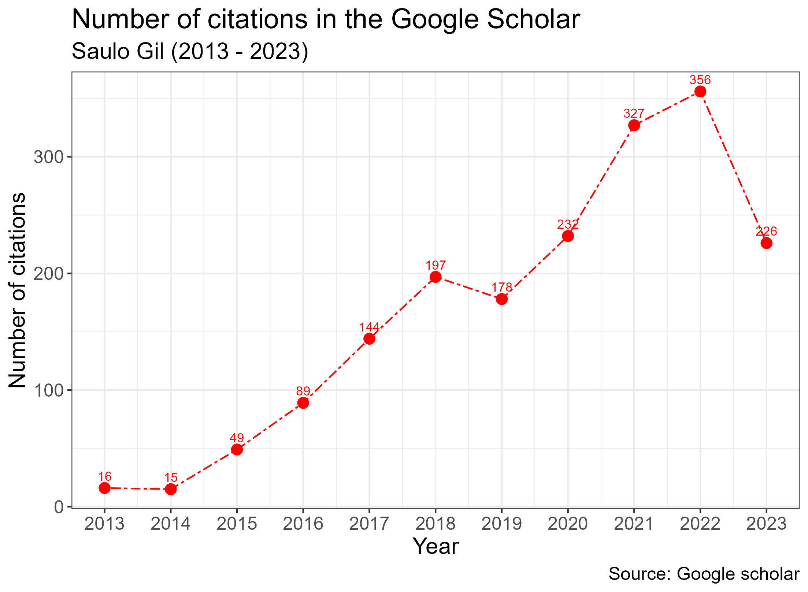

<!-- README.md is generated from README.Rmd. Please edit that file -->

```{r, include = FALSE}
knitr::opts_chunk$set(
  collapse = TRUE,
  comment = "#>"
)
```

# google_scholar_saulo

<!-- badges: start -->
<!-- badges: end -->

The goal of google_scholar_saulo repository was verifign my number of citations in the Google Scholar.

This analysis was performed in September 11, 2023.

```{r cars, echo=FALSE}

```

